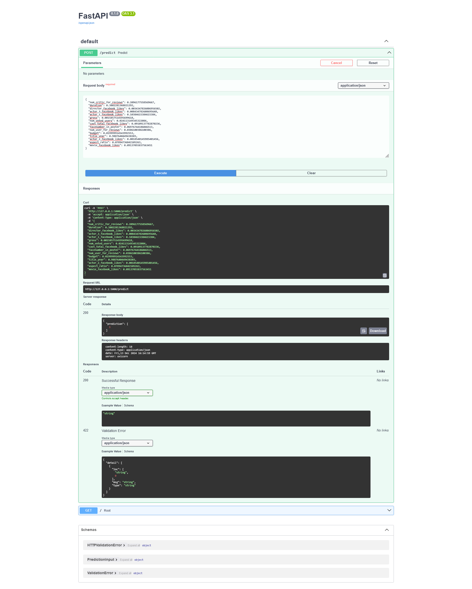

# Movie Prediction API

## Opis
Ten projekt implementuje serwis REST API dla przewidywania wyników filmu na podstawie cech wejściowych. API jest zbudowane przy użyciu **FastAPI** i uruchamiane w kontenerze Docker.

---

## Jak uruchomić kontener
1. **Zbuduj obraz Dockera**:  
   W katalogu z plikiem `Dockerfile` uruchom:  
   ```bash
   docker build -t movie-prediction-api .
   ```

2. **Uruchom kontener**:  
   ```bash
   docker run -d -p 5000:5000 movie-prediction-api
   ```

3. **Dokumentacja API**:  
   Po uruchomieniu API dokumentacja będzie dostępna pod adresem:  
   [http://localhost:5000/docs](http://localhost:5000/docs)


---

## Endpoint `/predict`
### Informacje o endpointzie:
- **Metoda**: POST  
- **URL**: `http://localhost:5000/predict`  
- **Opis**: Endpoint przyjmuje dane wejściowe w formacie JSON i zwraca przewidywanie.  

### Przykładowe dane wejściowe:  
```json
{
  "num_critic_for_reviews": 0.2096177558569667,
  "duration": 0.3802281368821292,
  "director_facebook_likes": 0.0034347826086956502,
  "actor_3_facebook_likes": 0.008434782608695648,
  "actor_1_facebook_likes": 0.10384615384615384,
  "gross": 0.0015857514595699618,
  "num_voted_users": 0.024113149345322084,
  "cast_total_facebook_likes": 0.09109137782870236,
  "facenumber_in_poster": 0.06976744186046513,
  "num_user_for_reviews": 0.0386100386100386,
  "budget": 0.019999914543992553,
  "title_year": 0.9887640449438203,
  "actor_2_facebook_likes": 0.0018540145985401456,
  "aspect_ratio": 0.07894736842105263,
  "movie_facebook_likes": 0.09137055837563451
}
```

### Przykładowa odpowiedź:  
```json
{
  "prediction": 3
}
```

---

## Testowanie
### Za pomocą `curl`:  
Uruchom poniższą komendę:  
```bash
curl -X 'POST' 
  'http://127.0.0.1:5000/predict' 
  -H 'accept: application/json' 
  -H 'Content-Type: application/json' 
  -d '{
  "num_critic_for_reviews": 0.2096177558569667,
  "duration": 0.3802281368821292,
  "director_facebook_likes": 0.0034347826086956502,
  "actor_3_facebook_likes": 0.008434782608695648,
  "actor_1_facebook_likes": 0.10384615384615384,
  "gross": 0.0015857514595699618,
  "num_voted_users": 0.024113149345322084,
  "cast_total_facebook_likes": 0.09109137782870236,
  "facenumber_in_poster": 0.06976744186046513,
  "num_user_for_reviews": 0.0386100386100386,
  "budget": 0.019999914543992553,
  "title_year": 0.9887640449438203,
  "actor_2_facebook_likes": 0.0018540145985401456,
  "aspect_ratio": 0.07894736842105263,
  "movie_facebook_likes": 0.09137055837563451
}'
```


### Za pomocą Postmana:
1. Otwórz Postmana.
2. Ustaw metodę na `POST`.
3. Wprowadź adres: `http://localhost:5000/predict`.
4. W sekcji **Body** wybierz opcję **raw** i ustaw typ na **JSON**.
5. Wprowadź dane wejściowe:  
   ```json
   {
     "num_critic_for_reviews": 0.2096177558569667,
     "duration": 0.3802281368821292,
     "director_facebook_likes": 0.0034347826086956502,
     "actor_3_facebook_likes": 0.008434782608695648,
     "actor_1_facebook_likes": 0.10384615384615384,
     "gross": 0.0015857514595699618,
     "num_voted_users": 0.024113149345322084,
     "cast_total_facebook_likes": 0.09109137782870236,
     "facenumber_in_poster": 0.06976744186046513,
     "num_user_for_reviews": 0.0386100386100386,
     "budget": 0.019999914543992553,
     "title_year": 0.9887640449438203,
     "actor_2_facebook_likes": 0.0018540145985401456,
     "aspect_ratio": 0.07894736842105263,
     "movie_facebook_likes": 0.09137055837563451
   }
   ```
6. Wyślij żądanie i sprawdź odpowiedź.

# Prognozowanie oceny filmu na podstawie danych z IMDB

## 1. Opis Projektu

### 1.1 Tło
Zestaw danych użyty w projekcie zawiera informacje o filmach, które obejmują różne atrybuty, takie jak nazwisko reżysera, czas trwania filmu, oceny krytyków, a także reakcje widzów, m.in. liczbę polubień na platformach społecznościowych. Projekt ma na celu zbadanie, które cechy filmu mają największy wpływ na ocenę na portalu IMDb i przewidywanie sukcesu filmu na podstawie jego atrybutów.

### 1.2 Opis atrybutów zestawu danych
Zestaw danych zawiera następujące atrybuty:

- **color**: Czy film jest w kolorze czy czarno-biały
- **director_name**: Nazwisko reżysera filmu
- **num_critic_for_reviews**: Liczba recenzji krytyków
- **duration**: Czas trwania filmu (w minutach)
- **director_facebook_likes**: Liczba polubień profilu reżysera na Facebooku
- **actor_3_facebook_likes**: Liczba polubień aktora nr 3 na Facebooku
- **actor_2_name**: Nazwisko aktora nr 2
- **actor_1_facebook_likes**: Liczba polubień aktora nr 1 na Facebooku
- **gross**: Dochód brutto filmu (w dolarach)
- **genres**: Gatunek filmu (np. 'Animation', 'Comedy', 'Romance')
- **actor_1_name**: Nazwisko aktora nr 1
- **movie_title**: Tytuł filmu
- **num_voted_users**: Liczba osób, które oceniły film
- **cast_total_facebook_likes**: Łączna liczba polubień całej obsady na Facebooku
- **actor_3_name**: Nazwisko aktora nr 3
- **facenumber_in_poster**: Liczba osób widocznych na plakacie filmowym
- **plot_keywords**: Słowa kluczowe opisujące fabułę
- **movie_imdb_link**: Link do filmu na IMDb (usunęliśmy ten atrybut w preprocessingu)
- **num_user_for_reviews**: Liczba recenzji użytkowników
- **language**: Język filmu
- **country**: Kraj produkcji
- **content_rating**: Kategoria wiekowa filmu
- **budget**: Budżet filmu (w dolarach)
- **title_year**: Rok premiery filmu
- **actor_2_facebook_likes**: Liczba polubień aktora nr 2 na Facebooku
- **imdb_score**: Ocena filmu na IMDb
- **aspect_ratio**: Proporcje obrazu filmu
- **movie_facebook_likes**: Łączna liczba polubień filmu na Facebooku

## 2. Wstępna analiza i podział danych

W ramach przygotowań do modelowania wykonano wstępną analizę oraz czyszczenie danych:

1. **Wczytanie danych**: Na początku wczytano zestaw danych zawierający informacje o filmach. Sprawdzono podstawowe informacje, takie jak początkowy kształt danych oraz typy kolumn, aby uzyskać przegląd struktury danych. Dane początkowo miały 5043 rekordów oraz 28 kolumn

2. **Czyszczenie danych**: W procesie czyszczenia usunięto kolumnę `movie_imdb_link`, która nie wnosiła istotnych informacji do analizy. Następnie usunięto wiersze zawierające brakujące wartości, co pomogło w zapewnieniu spójności i kompletności danych, które posłużą do modelowania. Po wyczyszczeniu danych zostało 3755 rekordów oraz 27 kolumn..

3. **Podział danych na zbiory treningowy i testowy**: Po zakończeniu wstępnej analizy podzielono dane na dwa zbiory – 70% do trenowania modelu oraz 30% do dalszego doszkalania. Podział ten pozwala na efektywne trenowanie modelu oraz późniejsze jego testowanie na odrębnych danych, co zwiększa wiarygodność wyników predykcji. Dane treningowe posiadają 2628 rekordy, a dane do doszkalnia 1127 rekordów.

